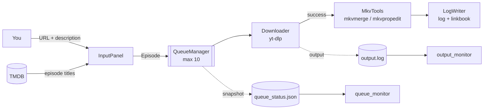

<div align="center">

# 📺 Epidex

### Series-centric media downloader — built on **yt-dlp**, enriched with **TMDB**

*Feed it episode links. Get a tidy, correctly named, correctly tagged season on disk.*


</div>

> [!WARNING]
> **Alpha.** Epidex is under active development and has not had a complete end-to-end release run yet. Expect rough edges. Bug reports are welcome.

---

## 📑 Table of contents

- [What is Epidex?](#-what-is-epidex)
- [Features](#-features)
- [How it works](#-how-it-works)
- [Requirements](#-requirements)
- [Installation](#-installation)
- [First run](#-first-run)
- [Usage walkthrough](#-usage-walkthrough)
- [Configuration (`.env`)](#-configuration-env)
- [Where files go](#-where-files-go)
- [Project structure](#-project-structure)
- [Architecture notes](#-architecture-notes)
- [Cookies & browsers](#-cookies--browsers)
- [Uninstalling](#-uninstalling)
- [Troubleshooting](#-troubleshooting)
- [Roadmap](#-roadmap)
- [Versioning & releases](#-versioning--releases)
- [Contributing](#-contributing)
- [License](#-license)
- [Credits](#-credits)

---

## 🎯 What is Epidex?

Epidex is a **terminal tool for building an organized media collection one season at a time**. You tell it which series and season you are working on; it pulls the episode titles from [TMDB](https://www.themoviedb.org/), then asks you for each episode's link and description. Downloads run in the background through [yt-dlp](https://github.com/yt-dlp/yt-dlp) (YouTube and any other site yt-dlp supports), and finished files are renamed, tagged and logged automatically.

While one episode downloads you can already type in the next one. Two live monitor windows show what is happening.

---

## ✨ Features

| | Feature | Details |
|---|---|---|
| 🎬 | **Series-centric workflow** | One run = one series + one season. Episode titles come from TMDB. |
| 🌐 | **Any yt-dlp site** | YouTube plus every other site yt-dlp supports. Only `http(s)` links are accepted. |
| 🧹 | **Link cleaning** | Strips YouTube's `si=` share-tracking parameter. Other sites and parameters are untouched. |
| 🗂️ | **Smart filenames** | `Series S01E005 Title.mkv`, zero-padded to the season's episode count, Windows-illegal characters removed. |
| 📥 | **Background queue** | A producer/consumer queue (max 10). Downloads are sequential, input never blocks until the queue is full. |
| 🏷️ | **MKV post-processing** | Reads runtime with `mkvmerge`, wipes global tags and sets the audio track's language and name with `mkvpropedit`. |
| 🖥️ | **Live monitors** | Two extra terminal windows/tabs: raw tool output and a live queue view. |
| 🧰 | **Self-resolving tools** | Finds `yt-dlp`, `ffmpeg`, `deno`, `mkvmerge`, `mkvpropedit`, and offers to install what is missing. |
| 💾 | **Metadata cache** | TMDB season data is cached per series and season, with a fallback if the network fails. |
| 📝 | **Log + linkbook** | Every episode gets a log line, every URL goes into a linkbook (failures are marked). |
| 🔁 | **OS-aware config** | Switching between Linux and Windows is detected; `.env` is backed up per OS and can be restored. |
| 🍪 | **Browser cookies** | Uses your Firefox cookies through yt-dlp (other browsers and `cookies.txt` planned). |
| 🛡️ | **Safe shutdown** | Quitting drains the queue first, then closes the monitors. |

---

## 🔧 How it works



Per episode, the worker thread does:

1. `Downloader.download()` runs yt-dlp (preferring `avc1`/H.264 for compatibility, falling back to any codec), merging into **MKV**.
2. On success: `MkvTools.fetch_runtime()` reads the duration (whole minutes, rounded up), then `MkvTools.scrub_and_tag()` cleans tags and labels the audio track.
3. A log line (`<ep> <runtime> <description>`) and the URL are written. A failed download is logged with `NOT SUCCESSFUL!!`.
4. A random 3 to 8 second pause, then the next episode.

---

## 📋 Requirements

- **Python**: the version shown in the badge above (`requires-python` in `pyproject.toml`)
- **Linux or Windows** (macOS is not supported yet)
- A **TMDB API key**: [get one here](https://www.themoviedb.org/settings/api)
- For terminal monitors on Linux: a graphical session (`DISPLAY` or `WAYLAND_DISPLAY`) and one of `kitty`, `alacritty`, `wezterm`, `foot`, `gnome-terminal`, `konsole`, `xterm` (or set `$TERMINAL`)
- On Windows, [Windows Terminal](https://aka.ms/terminal) (`wt`) is used if present, otherwise a new console window opens

**External tools** (Epidex finds them, or installs them for you):

| Tool | Used for | How Epidex installs it |
|---|---|---|
| `yt-dlp` | Downloading | Static binary from the official GitHub releases |
| `ffmpeg` | Merging streams | yt-dlp's patched FFmpeg build |
| `deno` | JS runtime for yt-dlp | Official release zip (OS and CPU aware) |
| `mkvmerge` / `mkvpropedit` | Runtime + tagging | System package manager (`winget`, `apt`, `dnf`, `pacman`, `zypper`), may ask for your password |

Python packages: `requests`, `python-dotenv`, `rich`, `platformdirs`.

---

## 📦 Installation

```bash
git clone https://github.com/AyanDaw/epidex.git
cd epidex
python -m venv .venv
# Linux:   source .venv/bin/activate
# Windows: .venv\Scripts\activate
pip install -r requirements.txt
```
Run it from the `src/` folder:

```bash
cd src
python -m epidex
python -m epidex --version
```

> Epidex is **not** distributed through PyPI. It is meant to be run from source, or as a launcher shim / PyInstaller binary.

---

## 🚀 First run

On the first launch there is no `.env`, so Epidex asks for:

1. **TMDB API key** (typed hidden)
2. **Series name**
3. **TMDB series ID** (the number in the TMDB URL of the show)
4. **Season number**
5. **Download folder** (optional, blank means `~/Downloads/<Series> S<season>`)

Then it checks the five external tools. If any are missing you can let Epidex download them, or install them yourself and press Enter to re-check (`q` quits).

On later launches you are asked once whether you want to change anything, with an edit menu for the API key, series info, download folder, dependency paths and a backup viewer.

---

## 🕹️ Usage walkthrough

1. **Start episode.** Enter the first episode number to download and confirm it.
2. Two monitor windows open:
   - **Output monitor:** live yt-dlp / mkvmerge / mkvpropedit output
   - **Queue monitor:** the episode being processed, queue fill (`n/10`) and upcoming titles
3. For each episode, Epidex shows its TMDB title, then asks for:
   - the **episode URL** (type `quit` to stop adding)
   - the **description** (stored in the log)
4. The episode is queued and the next one is asked immediately.
5. If the queue is full you get a short break message, and input resumes once 2 slots are free.
6. When you type `quit`, or the season's last episode is reached, Epidex finishes everything still queued and then closes the monitors.

**Keys and edge cases**

| Situation | What happens |
|---|---|
| `Ctrl+C` at the URL or description prompt | Cancels only that entry; the same episode is asked again |
| `Ctrl+C` during a break or the skip question | Stops adding episodes; the queue still finishes |
| TMDB has no title for an episode | Offered to skip it (`[SKIPPED]` is logged) or stop |
| Last episode reached | `[FINALE]: Season complete` is logged |

> [!IMPORTANT]
> Do not close the program while it says *"Finishing up remaining downloads in the queue..."*. A download already running is not killed by `Ctrl+C`, because yt-dlp runs in its own process session.

---

## ⚙️ Configuration (`.env`)

Epidex owns the `.env` file in the project root. You normally never edit it by hand, as the edit menu does it for you.

| Key | Meaning |
|---|---|
| `TMDB_API_KEY` | Your TMDB API key |
| `SERIES` | Series name (used in filenames and folders) |
| `SERIES_ID` | TMDB series ID |
| `SEASON` | Season number |
| `DOWNLOAD_DIR` | Optional custom download folder |
| `YT_DLP_PATH`, `FFMPEG_PATH`, `DENO_PATH`, `MKVMERGE_PATH`, `MKVPROPEDIT_PATH` | Resolved binary paths, filled in automatically |
| `LAST_OS` | Used to detect OS changes. Not user-editable |

**Backups:** one slot per OS (`.env.Linux`, `.env.Windows`), always overwritten. Corrupted backups are detected and never restored silently.

**Hardcoded for now** (edit in `cli.py`): audio language `ben` / `[ বাংলা (Bengali) ]`, codec `avc1`, queue size `10`, browser `firefox`.

---

## 🗃️ Where files go

```text
epidex/
├── .env                              # config (git-ignored)
└── data/                             # app data (git-ignored)
    ├── monitors/
    │   ├── output.log                # raw tool output
    │   ├── queue_status.json         # live queue snapshot
    │   └── STOP_MONITORS             # shutdown flag
    └── User/<Series>/S<season>/
        ├── metadata.json             # cached TMDB season
        ├── log_file.txt              # "<ep> <runtime> <description>"
        └── linkbook.txt              # every URL (failures marked)
```

- **Downloads:** your `DOWNLOAD_DIR`, or `~/Downloads/<Series> S<season>/`
- **Managed tools:** `~/.local/bin` (Linux) or `%LOCALAPPDATA%\epidex\tools` (Windows)

---

## 🧱 Project structure

```text
src/epidex/
├── __main__.py        # python -m epidex, checks Python packages first
├── cli.py             # entry point; builds and wires every object
├── paths.py           # the single source of truth for all paths
├── env_manager.py     # the only module that reads/writes .env
├── dependencies.py    # find / install yt-dlp, ffmpeg, deno, mkvtoolnix
├── tmdb.py            # fetch + cache TMDB season metadata
├── input_panel.py     # interactive producer of Episodes
├── episode.py         # pure data class for one episode
├── queue_manager.py   # queue + worker + status-writer threads
├── downloader.py      # yt-dlp subprocess
├── mkv_tools.py       # mkvmerge / mkvpropedit wrappers
├── logging_utils.py   # LogWriter (log + linkbook)
├── monitors/
│   ├── output_monitor.py
│   └── queue_monitor.py
└── viewer.py          # (planned) built-in log/link viewer
```

---

## 🏛️ Architecture notes

- **`cli.py` is the only module that knows all the others.** It builds objects once and passes them in explicitly (dependency injection).
- **One tool, one owner.** `Downloader` owns yt-dlp, `MkvTools` owns mkvmerge/mkvpropedit, `EnvManager` owns `.env`, `paths.py` owns every path.
- **`dependencies.py` is a pure function boundary:** it reports, never prints, never exits. Install strategy per tool is deliberate: static binaries for yt-dlp, ffmpeg and deno, the system package manager for MKVToolNix (shared-library dependencies).
- **`Episode` is data only.** No subprocess, no filesystem.

---

## 🍪 Cookies & browsers

Epidex passes `--cookies-from-browser` to yt-dlp so age-gated or logged-in content works.

- Currently only **Firefox** is supported, and you must be logged in to the site in it. Firefox forks (Zen, LibreWolf, Floorp...) store their cookies in their own profile folder, and Epidex doesn't pass a profile path yet, so they don't work reliably.
- **Chromium-based browsers** (Chrome, Edge, Brave...) aren't supported yet. `cookies.txt` support is planned (see Roadmap).
- To use another browser for now, edit `downloader.py`.
- The **browser must be closed** while downloading on some OS/browser combinations, as its cookie database is locked.
- On **Linux**, decrypting cookies can need extra keyring packages.

These are runtime failures that show up in the output monitor, not something the dependency check can detect upfront.

---

## 🧹 Uninstalling

An automatic uninstaller is planned. Until then, remove things by hand:

- **Epidex itself:** delete the project folder. This also removes `.env`, its backups and `data/` (logs, linkbooks, cached metadata).
- **Downloaded episodes:** these live in your download folder and are never touched. Delete them yourself if you want.
- **Tools Epidex downloaded:** `yt-dlp`, `ffmpeg` and `deno` in `~/.local/bin` (Linux) or `%LOCALAPPDATA%\epidex\tools` (Windows).
  > On Linux that folder is shared. Remove only these three files, and only if you didn't install them for other uses.
- **MKVToolNix:** installed through your package manager, so remove it the same way (`apt remove mkvtoolnix`, `winget uninstall MKVToolNix`, etc.).

---

## 🩺 Troubleshooting

| Problem | Try this |
|---|---|
| `missing required package(s)` | `pip install -r requirements.txt` inside your venv |
| Monitor windows don't open on Linux | Make sure a display is available and a supported terminal is installed, or set `$TERMINAL` |
| Cookie / database locked error | Close the browser; on Linux check keyring packages |
| `Bad API key` / `Series or season not found` | Re-check key, series ID and season in the edit menu |
| A tool keeps showing as missing | Make sure it works from a terminal (`<tool> --version`), or enter its path in *Dependency paths* |
| Episode has no title | Skip it and download it manually, or restart after TMDB updates |

---

## 🗺️ Roadmap

- [ ] **Browsers:** Configurable browser + profile path (validated against yt-dlp's browser list), so Firefox forks like Zen work
- [ ] **Cookies:** `cookies.txt` support, mainly for Chromium-based browsers (Chrome, Edge, Brave), where reading cookies directly is unreliable
- [ ] **Configurable Tags:** Configurable audio language, codec and queue size from settings
- [ ] **Env Separation:** Separate series and app settings (`.show.env` / `.app.env`)
- [ ] **Uninstaller:** a dedicated module that asks first and removes only the files Epidex itself put on your machine. It can't wipe `~/.local/bin`, since other tools live there too.
- [ ] **Built-in viewer** for logs and links (`viewer.py`)
- [ ] **Updater** for yt-dlp, ffmpeg and deno (kept separate from the startup check, which stays fast and offline)
- [ ] **JSON logbook** with per-episode, per-task status, so failed steps can be retried individually
- [ ] **Retry system** for failed downloads, built on that logbook
- [ ] Multi-user support with a database
- [ ] GUI frontend (on hold)

---

## 🏷️ Versioning & releases

The version lives in `pyproject.toml` and `src/epidex/__init__.py`. Check yours with `python -m epidex --version`, or see the latest tag on GitHub.

---

## 🤝 Contributing

- 🐛 **Found a bug?** [Open an issue](https://github.com/AyanDaw/epidex/issues/new) with your OS, `python --version`, `python -m epidex --version`, what you did, and the relevant lines from `data/monitors/output.log`. Remove your API key and any private links first.
- 💡 **Have an idea?** Open an issue describing the problem it solves before writing code.
- 🔧 **Want to send a fix?** Fork, make a branch, keep each module's single responsibility intact (see [Architecture notes](#-architecture-notes)), and open a pull request that explains what changed and why. Open an issue first for anything large.

---

## 📄 License

No license has been chosen yet. Until one is added, all rights are reserved.

---

## 🙏 Credits

- [yt-dlp](https://github.com/yt-dlp/yt-dlp) and the [yt-dlp FFmpeg builds](https://github.com/yt-dlp/FFmpeg-Builds)
- [Deno](https://deno.com/)
- [MKVToolNix](https://mkvtoolnix.download/)
- [TMDB](https://www.themoviedb.org/): *this product uses the TMDB API but is not endorsed or certified by TMDB.*
- [Rich](https://github.com/Textualize/rich), [python-dotenv](https://github.com/theskumar/python-dotenv), [platformdirs](https://github.com/tox-dev/platformdirs), [Requests](https://requests.readthedocs.io/)
